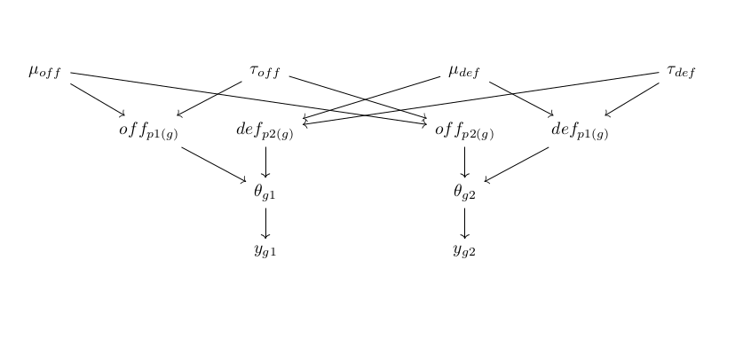
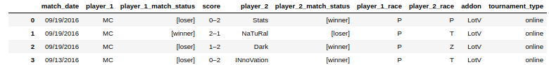
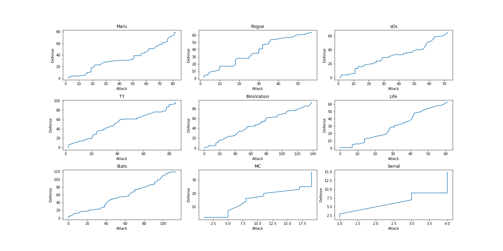
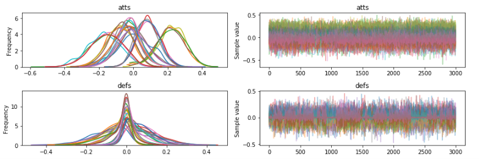
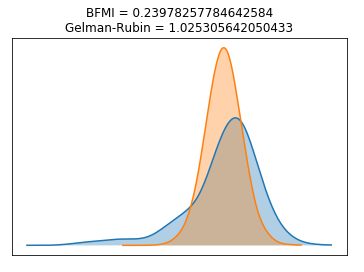

```{r setup, include=FALSE}
knitr::opts_chunk$set(echo = FALSE)
```

## Outline of Presentation

1.  Introduction to Bayesian Rating Models
2.  Modification of related approaches
3.  A brief look at data preparation
4.  pymc3
5.  Preliminary results
6.  What next?
7.  Litterature

# Introduction to Bayesian Rating Models

## Idea
* Wish to model the match outcome or score for players/teams
* Hypothesize that some matchups are more/less favorable than others
* Due to particular player/team strengths/weaknesses 
* Hypothesize that these can be modeled as latent features from some prior distribution
* Outcome/score of match can be modeled as a function of these features

## Approach
* Employ some hypothetical numerical measure of player strength.
* Divide the measure of strength into defensive and offensive capabilities:
    + $off_{p} \sim Normal(\mu_{off}, \tau_{off})$
    + $def_{p} \sim Normal(\mu_{def}, \tau_{def})$
* We are concerned with score, rather than match outcome directly:
    + $log\theta_{p1} = off_{p1} + def_{p2}$
    + $log\theta_{p2} = off_{p2} + def_{p1}$
    
## Approach
* The $\theta_{p}$-values represent the point intensity of players, respectively
* We can then formulate the outcome of a particular game as:
    + $y_{gj} | \theta_{gj} \sim Poisson(\theta_{gj})$
* This Poisson-logNormal type of model appears to be widedly used in the litterature

# Modification

## Baio & Blangiardo (2009)
Present an approach for modelling the outcome of football results in the Italian Series A 

Poisson-log-Normal model with explicit modelling of attacking and defensive capabilities of both teams.

Construction of hyper-priors of attack and defense effects modeled independently with flat prior distributions.

$$
\mu_{att/def} \sim Normal(0, 0.0001) \\
\tau_{att/def} \sim Gamma(0.1, 0.1)
$$
Under a zero-sum constraint on the mean-parameter, $\mu$.

## Baio & Blangiardo (2009)
They also explicitly model the home-court advantage as:
$$
home \sim Normal(0, 0.0001) \\
log\theta_{g1} = home + att_{h(g)} + def_{a(g)}
$$

## Deviations from Baio & Blangiardo
Discard $\mu_{att/def}$, as we're imposing a zero-sum constraint anyways; such that we model the offense/defense parameters as:
$$
off_{p} \sim Normal(0, \tau_{off}) \\
def_{p} \sim Normal(0, \tau_{def})
$$

Discard the $home$ parameter - as it does not seem to make much sense in an online-game:
$$
log\theta_{g1} = off_{p1(g)} + def_{p2(g)} \\
log\theta_{g2} = off_{p2(g)} + def_{p1(g)}
$$

## Baseline Model
$$
y_{gj}|\theta_{gj} = Poisson(\theta_{gj}) \\
log \theta_{g1} = off_{p1(g)} + def_{p2(g)} \\
log \theta_{g2} = off_{p2(g)} + def_{p1(g)} \\
off_{p} \sim Normal(0, \tau_{off}) \\
def_{p} \sim Normal(0, \tau_{def}) \\
\tau_{off} \sim Gamma(0.1, 0.1) \\
\tau_{off} \sim Gamma(0.1, 0.1)
$$

## DAG of Baseline Model
(Directed Acyclic Graph)




# A brief look at data preparation

## Description
The [starcraft-ii-matches-history](https://www.kaggle.com/alimbekovkz/starcraft-ii-matches-history) dataset from Kaggle consists of 374.794 rows. That's a 187.397 1v1 matches.

Distributed among 1.856 unique players. 




Some exclusions are needed.

## Selecting 9 Best Players
I'm lazy, so:
```python
link = "https://www.esportsearnings.com/games/151-starcraft-ii/top-players"
xpath= '//*[@class="format_cell detail_list_player"]/a[2]/text()'
page = requests.get(link)
tree = html.fromstring(page.content)
top  = tree.xpath(xpath)
top9 = top100[:9]
```
Top 9 players:
```python
['Maru', 'Rogue', 'sOs', 'TY', 'INnoVation', 
 'Life', 'Stats', 'MC', 'Serral']
```
## A look at their performance

```{r, out.width = "800px"}

```

MC and Serral each constitute ~0.04 of the 9 players' played games. Exclude them.
Final dataset: 7 unique players. 400 rows, 200 matches. 

# pymc3

## Specification of baseline model

```python
with pm.Model() as base_model:
    tau_att    = pm.Gamma('tau_att', 0.1, 0.1)
    tau_def    = pm.Gamma('tau_def', 0.1, 0.1)
    atts_star = pm.Normal("atts_star", mu = 0, 
                          sd = tau_att, shape = n_players)
    defs_star = pm.Normal("defs_star", mu = 0, 
                          sd = tau_def, shape = n_players)
    atts = pm.Deterministic('atts', atts_star - tt.mean(atts_star))
    defs = pm.Deterministic('defs', defs_star - tt.mean(defs_star))
    p1_theta = tt.exp(atts[player_1] + defs[player_2])
    p2_theta = tt.exp(atts[player_2] + defs[player_1])

    p1_points = pm.Poisson('p1_points', mu = p1_theta, 
                           observed = observed_player1_score)
    p2_points = pm.Poisson('p2_points', mu = p2_theta, 
                           observed = observed_player2_score)
```

# Preliminary Results

## Model convergence - 1


Ideally, we'd want a higher dispersion of correlation measures. 

## Model convergence - 2


According to [PyStan Documentation](http://mc-stan.org/users/documentation/case-studies/pystan_workflow.html), a BFMI (Bayesian Fraction of Missing Information) of below 0.2 suggests poor sampling.

The Gelman-Rubin stastic should be around 1 - larger values suggests that one or more chains in the MCMC procedure did not converge. 

## Evaluating the baseline model

* Model did not converge properly
* Multiple variations on the sampling parameters have been tried
* Slight variations on the model composition have been attempted
* More sophisticated model composition may be needed

# What next?

## What next?
* Get model to converge
* Further experimentation with model specification:
    + Include intercept
    + Revision of priors
* Extend to hierarchical model based on race, e.g. Zerg
* Draw offensive/defensive hyperparams from bivariate distr.
* Use binomial target and focus on win/lose

# Litterature

## Litterature

[Bayesian hierarchical model for the prediction of
football results, Baio & Blangiardo (2010)](http://citeseerx.ist.psu.edu/viewdoc/download?doi=10.1.1.182.8659&rep=rep1&type=pdf)

[Analysis of Sports Data by Using Bivariate Poisson Models, Karlis & Ntzoufras (2003)](https://www.jstor.org/stable/4128211?seq=1#page_scan_tab_contents)

[Bayesian hierarchical models for predicting individual performance in soccer, Egidi & Gabry (2018)](https://www.researchgate.net/publication/327042737_Bayesian_hierarchical_models_for_predicting_individual_performance_in_soccer)

[Hierarchical bayesian rating model in PyMC3 with application to eSports, Kevin Pei Blog 2017](http://kpei.me/blog/?p=999)


[Lecture 3: Sports rating models, Berkeley Statistics 2016, David Aldous](https://www.stat.berkeley.edu/~aldous/157_2016/Slides/lecture_3.pdf)


